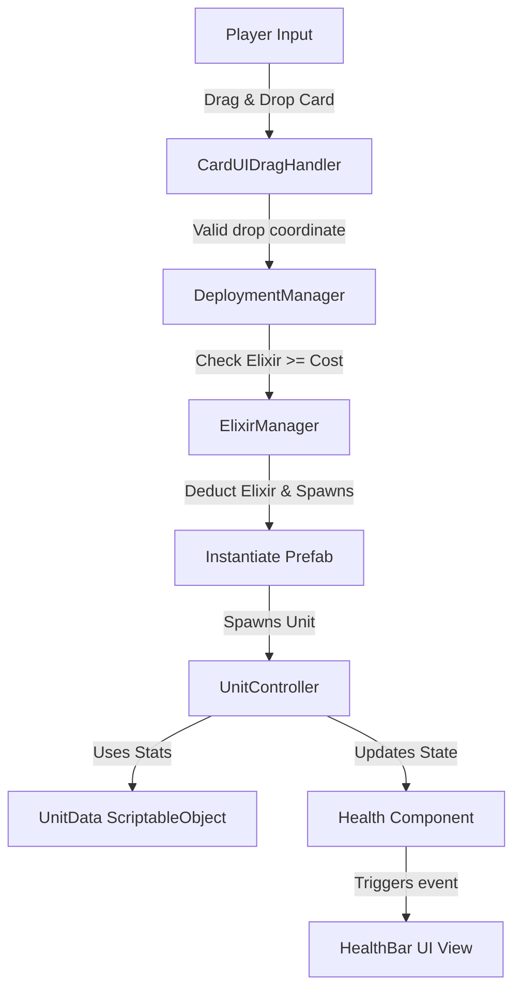

# Architecture Document - Mobile Strategy Card Game

This document outlines the software architecture and system relationships for the 1v1 mobile strategy card game prototype built in Unity 6.

---

## 1. Architectural Patterns & Goals
* **Model-View-Controller (MVC) Separation**:
  - **Model**: ScriptableObjects (`CardData`, `UnitData`) and state managers (`ElixirManager`, `CardHandManager`) store data and state. They contain no direct rendering/visual logic.
  - **View**: Handlers (`CardUIDragHandler`, Health Bar UI, floating text) listen to model state changes and reflect them visually.
  - **Controller/Engine**: Managers (`DeploymentManager`, Combat engine, AI loops) execute actions based on user inputs and physics updates.
* **Event-Driven Communication**:
  - Systems communicate using C# Actions/Events to avoid tight coupling. For example, when a unit takes damage, it raises `OnHealthChanged`. UI bars listen to this event rather than the combat system polling HP values.
* **Network-Ready Design**:
  - Game logic is deterministic and driven by logical ticks.
  - State controllers (like Elixir or hand rotations) operate through clean method interfaces (e.g. `SpendElixir(int amount)`, `DeployCard(int slotIndex)`), allowing multiplayer servers (Netcode/Photon) to easily intercept, validate, and synchronize commands.

---

## 2. Component Layout & Folders

```
Assets/
├── Art/                       # Sprites, Textures, Meshes
├── Audio/                     # Sound effect clips
├── Animations/                # Animation controllers and clips
├── Materials/                 # Render pipelines materials
├── Prefabs/                   # Instantiated objects (troops, spells, projectiles)
├── ScriptableObjects/         # Saved configurations (KnightCard, ArcherCard)
└── Scripts/
    ├── Cards/                 # CardData, HandManager, UIDragHandler
    ├── Combat/                # Health, Damageable, Projectile, CombatEvents
    ├── Core/                  # ElixirManager, DeploymentManager, GameManager
    ├── Units/                 # UnitController, UnitData, UnitMovement
    ├── Towers/                # TowerController
    ├── UI/                    # HealthBarUI, ElixirBarUI, MenuUI
    └── Editor/                # ProjectInitializer, Custom Inspectors
```

---

## 3. Data Flow Model



---

## 4. Systems Design for Stage 1

1. **CardData & UnitData (ScriptableObjects)**: Holds definitions. Decoupled so that a "Knight Card" could spawn a "Knight Unit", while a "Knight Guard Card" might spawn three "Knight Units" referencing the exact same stats database.
2. **ElixirManager**: Manages a float-based elixir count from 0 to 10. Regenerates at a fixed rate per frame. Emits events when elixir levels change.
3. **CardHandManager**: Shuffles the 8-card player deck, populates a 4-card active hand, and tracks a queue for the next card. Cycles cards upon deployment.
4. **CardUIDragHandler**: Captures mobile touches/drags. Raycasts into the canvas. Visualizes card hover previews, translates to battlefield raycasts, and passes drops to the deployment controller.
5. **DeploymentManager**: Checks if drop coordinate is within valid bounds. Instantiates the unit prefab at the world coordinate and tells `CardHandManager` to cycle the deck slot.
